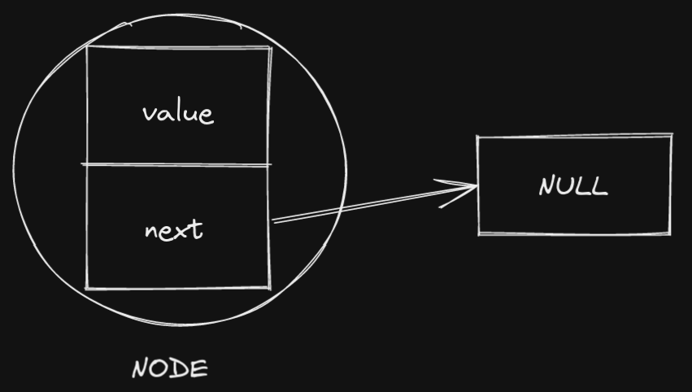
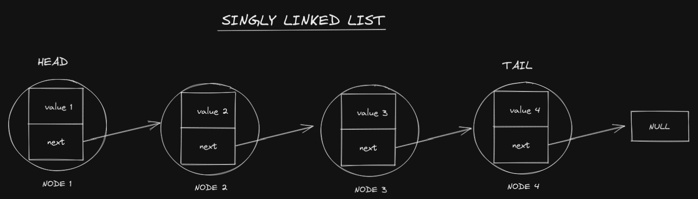

# Singly Linked Lists in JavaScript

This article will talk about the singly linked list data structure using JavaScript. Let's start by understanding what a linked list is, how it is used and then move onto the different methods in the singly linked list.

# What is a Linked List?

A linked list is a type of linear data structure (arrays also fall into this category). A linear data structure is a data structure whose information is arranged in a sequential order.

Unlike arrays, a linked list is composed of nodes. Each node is composed of a value, and a `next` pointer which points to the next node in the singly linked list. In the case of a doubly linked list, the node will also contain a `prev` pointer, pointing to the previous node.

Another difference between an array and a linked list is that linked lists are not indexed like arrays are. So in order to find a value in a singly linked list, you have to start at the first node, and then traverse the linked list using each node's pointer to get to the node that you are looking for.

Below you can find a pictorial representation of a node and a singly linked list:

Image of a Node from a Singly Linked List:


Image of a Singly Linked List:


## Properties of a Linked List:

### head and tail nodes:

A linked list will generally keep track of the `head` and `tail` nodes.

The `head` node is the 1st node in the linked list.
If the linked list is a doubly linked list, the `prev` pointer of the `head` node will point to `null`. If the linked list is a doubly linked list, it does not have a `prev` pointer.

The `tail` node is the last node in the linked list. The `next` pointer of the tail node will generally point to `null` unless it is part of a circular linked list.
In a circular linked list, the `next` pointer of the `tail` node points back to the `head` node.

### size

While this can be derived using a helper method, we will make it easier on ourselves by keeping track of a `size` property which will be an integer number representing the number of nodes in the linked list.

## How Linked Lists Behave in Memory:

Imagine a grid with each square represents a piece of memory. Let's say that we can store a single node or element in each location of memory represented by each square.

When an array is stored in memory, each element is stored in an adjacent piece of memory. If you have 5 elements in the array, you have to have 5 consecutive squares (locations) in memory in order to store the array. If you don't have 5 pieces of consecutive location in memory, you have to find another spot on the grid where you do have 5 empty memory locations.

Linked lists on the other hand don't require consecutive locations in memory to store their data. Instead, each of the linked list's nodes can be in any slot in memory and they are connected via pointers. So for singly linked lists, as long as you know where the 1st node in the linked list is, you can hop from one node to the other using the pointers to traverse the entire linked list.

# What are the Advantages and Disadvantages of a Linked List?

To understand the advantages and disadvantages of a linked list, we will be comparing them to arrays and using Big-O notation.

Elements in an array can be accessed in O(1) time. O(1) is also called constant time. If this is still confusing, think about it as only requiring one operation to perform. No matter how many elements the array has, accessing any element is as simple as typing `arr[i]`. Under the hood, the computer will look at the `ith` position of the array and return the value at that position.

In contrast, accessing a node in a linked list is generally O(n) time. If there are `n` nodes in the linked list, and the node is in the `nth` position, then we have to traverse the whole linked list (go from one node to the next) in order to get to the `nth` node. This is because instead of using indicies to access the values of each node, we traverse (move through the singly linked list one node at a time) each node oen at a time and go to the next node by following the pointers until we reach the node we were looking for.

The worst case for adding or removing elements in an array is when using the `unshift` and `shift` methods to add or remove an element from the beginning of the array. This is because in order to remove or add data to the array, the rest of the elements in the array need to be re-indexed. This means that to add or remove 1 element in an array to the front, there are `n` operations that must occur, i.e., O(n) time.

In the memory section, we spoke about the fact that nodes of a singly linked list do not require consecutive locations in memory. This means that it is much easier for the computer to store a linked list in memory because it does not need to worry about finding consecutive blocks of memory to store the nodes of the singly linked list.

## Summary of Advantages and Disadvantages of Linked Lists (when compared to arrays):

Advantages:

- Faster average insertion and removal times due to not needing to re-index other elements (just need to break and reconnect a few pointers)
  - Insertion and removal times are O(1)
- More storage efficient in memory than arrays due to not requiring consecutive blocks of memory to be used.

Disadvantages:

- Slower average access (read) times due to needing to traverse each node to get to the desired value
  - Read times are O(n)

# What is the Difference between a Singly Linked List and a Doubly Linked List?

The only difference between a singly linked list and a doubly linked list is the fact that each node in a singly linked list only contains a `next` pointer to the next node. A doubly linked list contains a `next` and a `prev` pointer which allows you to traverse the doubly linked list in 2 directions.

# Introducing the Node Class:

Before writing the singly linked list class, we need to write a separate class for the `node`s of the singly linked list.

Each node of a singly linked list will have the following properties:

- `value`: this will store the value of the node
  - This can be of any value type allowed in JS
- `next`: this will represent the pointer to the next node of the singly linked list
  - This pointer will be initialize to null
  - We will change what the pointer "points" to in the other Singly Linked List methods.

**PSEUDOCODE for Node Class:**

```js
/*
Define the Node class
  Create a constructor function for Node class
  the constructor function accepts a value parameter
    initialize the value property to the value parameter
    initialize the next property to null

*/
```

**CODE for Node Class:**

```js
class Node {
  constructor(value) {
    this.value = value;
    this.next = null;
  }
}
```

# Introducing the Singly Linked List Class:

Let's walk through creating a Singly Linked List class and the corresponding constructor function. After this is done, we will walk through creating common methods which will be then added to the Singly Linked List class.

# Common Methods of a Linked List:

## Inserting Nodes into a Singly Linked List:

### pushing:

The `push` method appends a new node to the end of the linked list.

**PSEUDOCODE for push method:**

```js

```

**CODE for push method:**

```js

```

### unshift:

The `unshift` method prepends a new node to the beginning of the linked list.

**PSEUDOCODE for unshift method:**

```js

```

**CODE for unshift method:**

```js

```

### insert:

The `insert` method inserts a new node at a specified position in the linked list.

**PSEUDOCODE for insert method:**

```js

```

**CODE for insert method:**

```js

```

## Removing nodes from a Singly Linked List:

### pop:

Remove a Node from the End

**PSEUDOCODE for pop method:**

```js

```

**CODE for pop method:**

```js

```

### shift (Removing a Node from the Beginning):

**PSEUDOCODE for shift method:**

```js

```

**CODE for shift method:**

```js

```

### removeNode:

The `removeNode` method removes a node from the linked list at a specific location in the linked list.

**PSEUDOCODE for removeNode method:**

```js

```

**CODE for removeNode method:**

```js

```

## Searching for Nodes in the Linked List:

### findHead:

### findTail:

### find:

## reverse:
